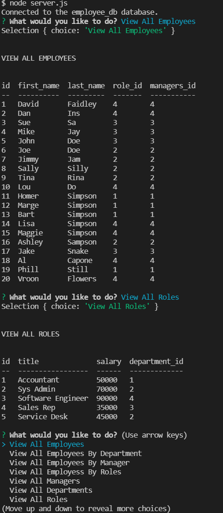

## Title: Employee Tracker using MySQL + JS
## Description: 
This app was built with the intention of storing data about employees and their orginazation such as managers, roles, and department.
## Table of Contents: 

- [Installation](#installation)
- [Usage](#usage)
- [License](#license)
- [Contributions](#contributions)
- [Questions](#questions)

## Installation: 
- You would need to go to my repo and clone it to your system
- Then you would run npm i and that should get all the required packages.
- Then you would log into mysql as your local user and run the source schema.sql command and then run source seeds.sql to build the tables and seed them with data.
- Once you have done that you will then be able to simply run node server.js and the app will start

## Usage:
Below you will be able to see a quick walkthrough video of how this applicaiton works. It is meant to be able to store employees, departments, include their roles and managers and be able to show all of the above in a table when called upon.

## License: 

https://opensource.org/licenses/MIT
## Contributions: 
- DU Staff

## Questions: 
Contact me at david.faidley23@gmail.com

https://github.com/dfaidley23

Employee Tracker using MySQL + JS